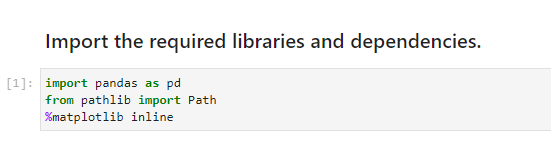

# Arbitrage Opportunities in Bitcoin and other Cryptocurrencies

___
The main purpose of this project is to find any arbitrage opportunities between the price of Bitcoin in two exchanges: Bitstamp and Coinbase.

I will do so by collecting, preparing, and analyzing data and finally putting it together in my analysis report.

---

## Technologies

This project leverages python 3.7 with the Library and IDE:

* [Pandas](https://www.w3schools.com/python/pandas/pandas_dataframes.asp) - A useful python library for analysis.

* [Jupyterlab](http://justinbois.github.io/bootcamp/2020_fsri/lessons/l01_welcome.html#Jupyter) - An interactive development environment

---

## Installation Guide

In order to run the application, one must first install the following dependencies.

* First one would open JupyterLab with the following in GitBash.

* One would the import pandas using the following

import pandas as pd

---

## Usage
To use the analysis, clone the repository and run the crypto_arbitrage.ipynb within the Jupyter Notebook.

---

## Contributors

Brought to you by Franco Thomas via the Columbia Engineering FinTech Bootcamp.

Significant contributions made by subcontractors Professor Marghub Mirza, TA Ashfaque, and TA Boomin Kwon.

---

## License

MIT
